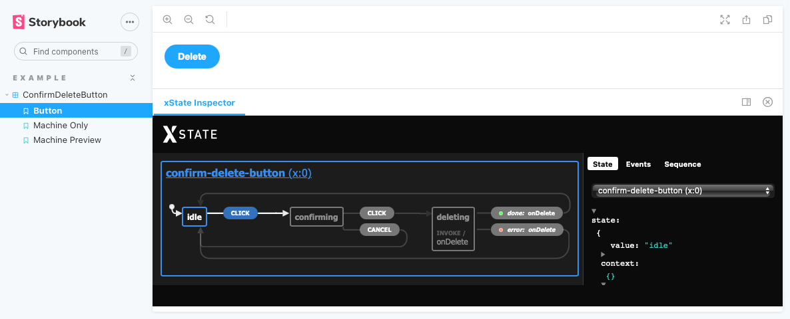

# xState Storybook Addon



To use this in storybook simply add `addons: ["storybook-xstate-addon/preset"]` to your storybook config.

Additionally, you can send events to a machine by id when it is registered by adding the `xstate` parameter.

For more example usages see [./stories/Button.stories.tsx] and [./stories/Machines.stories.tsx].

```jsx
StoryComponent.parameters = {
  xstate: {
    machine_id1: {
      events: "event",
    },
    machine_id2: {
      events: { type: "event" },
    },
    machine_id3: {
      events: [{ type: "event1" }, { type: "event2" }],
    },
    machine_id4: {
      events: (state) => "event",
    },
    machine_id5: {
      events: ["event1", "event2"],
      delay: 2.5e3, // milliseconds to delay before sending the next event
      shouldRepeatEvents: true, // for looping event sequences
    },
  },
};
```

If you wish to use the Inspector as the main story itself, simply use the following snippet.

```jsx
import { RenderMachine } from 'storybook-xstate-addon/RenderMachine';

export const MachinePreview = () => <RenderMachine machine={confirmMachine} options={...optionsToUseMachine} events={[...events]} />;
```

### Development scripts

- `npm run start` runs babel in watch mode and starts Storybook
- `npm run build` build and package your addon code

## Release Management

### Setup

This project is configured to use [auto](https://github.com/intuit/auto) for release management. It generates a changelog and pushes it to both GitHub and npm. Therefore, you need to configure access to both:
